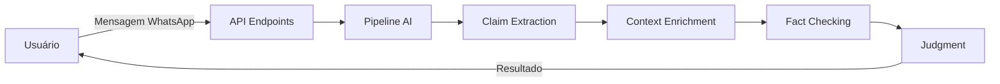

[⬅️ Voltar ao README Principal](../README.md)


# Estrutura do Projeto

Este documento descreve a organização de diretórios e arquivos do **Fake News Detector - Backend**.

## Visão Geral

```
backend/
├── app/                    # Código principal da aplicação
│   ├── ai/                 # Lógica de AI e fact-checking
│   │   ├── context/        # Apify e enrichment de contexto
│   │   ├── factchecking/   # Evidence retrieval e verificação
│   │   └── pipeline/       # Claim extraction e judgment
│   ├── api/                # Endpoints FastAPI
│   │   └── endpoints/      # Definição de rotas da API
│   ├── core/               # Configuração central
│   └── models/             # Schemas Pydantic
├── scripts/                # Scripts de automação
├── logs/                   # Arquivos de log persistidos
├── docker-compose.yml      # Configuração Docker
├── Dockerfile              # Imagem Docker
├── requirements.txt        # Dependências Python
└── README.md               # Documentação principal
```


## Detalhamento dos Diretórios

### 📁 `app/`
Diretório principal contendo todo o código da aplicação.

#### `app/ai/` - Inteligência Artificial
Módulos relacionados ao processamento de IA e verificação de fatos:

- **`context/`** - Coleta e enriquecimento de contexto
  - Integração com Apify para scraping
  - Enrichment de informações de fontes externas
  
- **`factchecking/`** - Verificação de Fatos
  - Evidence retrieval (busca de evidências)
  - Análise e validação de fontes
  
- **`pipeline/`** - Pipeline de Processamento
  - Claim extraction (extração de afirmações)
  - Judgment e classificação de veracidade

#### `app/api/` - API REST
Implementação dos endpoints da API usando FastAPI:

- **`endpoints/`** - Definições de rotas
  - Endpoints para receber mensagens
  - Endpoints de análise e verificação
  - Endpoints de consulta e relatórios

#### `app/core/` - Configuração
Configurações centrais da aplicação:
- Gerenciamento de variáveis de ambiente
- Configurações de logging
- Constantes e parâmetros do sistema

#### `app/models/` - Modelos de Dados
Schemas Pydantic para validação de dados:
- Modelos de request/response
- Estruturas de dados internas
- Validadores


### 📁 `scripts/`
Scripts de automação para facilitar o desenvolvimento e operação:

- `docker-start.sh` - Inicia o ambiente Docker
- `docker-stop.sh` - Para o ambiente Docker
- Outros scripts auxiliares


### 📁 `logs/`
Diretório para armazenamento de logs da aplicação:
- Logs são persistidos em arquivos
- Útil para debugging e monitoramento
- Ignorado pelo Git (configurado em `.gitignore`)


## Arquivos de Configuração

### `docker-compose.yml`
Define os serviços Docker e suas configurações:
- Configuração de containers
- Mapeamento de portas
- Volumes e redes

### `Dockerfile`
Instruções para construção da imagem Docker:
- Imagem base Python
- Instalação de dependências
- Configuração do ambiente

### `requirements.txt`
Lista de todas as dependências Python do projeto:
- FastAPI para a API REST
- OpenAI para processamento de linguagem
- Bibliotecas de scraping e análise
- Ferramentas de teste e desenvolvimento

### `.env` (não versionado)
Arquivo de variáveis de ambiente (criado a partir de `env.example`):
- Chaves de API
- Configurações específicas do ambiente
- **Nunca deve ser commitado no Git**


## Fluxo de Dados



O sistema processa mensagens através de um pipeline que:
1. Recebe o conteúdo via API
2. Extrai claims principais
3. Busca contexto e evidências
4. Realiza fact-checking
5. Gera um julgamento final
6. Retorna o resultado ao usuário


## 📚 Documentação Relacionada

- [📋 Requisitos](./REQUISITOS.md) - Requisitos do sistema
- [⚙️ Configuração](./CONFIGURACAO.md) - Configure o ambiente
- [▶️ Execução](./EXECUCAO.md) - Como executar o backend
